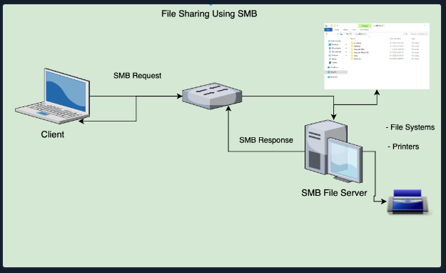

# **NTFS (New Technology File System) and share permissions**
- are two different types of permissions that can be used to control access to files and folders on a Windows-based computer.

- NTFS permissions are applied to files and folders stored on an NTFS-formatted volume and are used to control access at the file and folder level. They allow for very granular control over who can access files and folders, and what actions they can perform on them.

- Share permissions, on the other hand, are applied when a folder is shared over a network. They are used to control access to the shared folder and its contents over the network. Share permissions are more basic and less granular than NTFS permissions and are typically used in conjunction with NTFS permissions to provide additional security.

    - The phrase "They allow for very granular control" means that NTFS permissions provide a high level of specificity and precision in terms of who can access files and folders and what actions they can perform. This means that you can set permissions for specific users or groups, and define exactly what they can do (such as read, write, execute, etc.) with the files and folders in question. This allows for a high degree of flexibility and customization in controlling access to files and folders on an NTFS-formatted volume.

- It is important to note that when both NTFS and share permissions are in effect, the most restrictive permission will be applied.

___
# **SMBv1**
___

 - SMB (Server Message Block) is a network file sharing protocol that allows applications on a computer to read and write to files and to request services from server programs in a computer network. 
 
 - The Server Message Block protocol (SMB) is used in Windows to connect shared resources like files and printers. It is used in large, medium, and small enterprise environments. See the image below to visualize this concept:

 
 
 
 
 - SMBv1 is version 1 of the SMB protocol. It was first introduced in the 1980s and was widely used in Windows operating systems up until Windows Vista and Windows Server 2008.

- SMBv1 is known to have security vulnerabilities, such as the EternalBlue exploit, which was used in the WannaCry ransomware attack in 2017. Due to these security issues, Microsoft has recommended disabling SMBv1 on all systems to prevent potential security breaches. They have also released later versions of SMB protocol to address the vulnerabilities found in SMBv1.

___
**Let’s take a look at the individual permissions that can be set to secure/grant objects access to a network share hosted on a Windows OS running the NTFS file system.**

**__Share Permissions__**

|Permission|Descriptions|
|-----------|------------|
|Full Control	|Users are permitted to perform all actions given by Change and Read permissions as well as change permissions for NTFS files and subfolders|
|Change    |Users are permitted to read, edit, delete and add files and subfolders|
|Read	|Users are allowed to view file & subfolder contents|

**__NFTS BASIC PERMISSIONS__**

|Permission|Descriptions|
|-----------|------------|
|Full Control	|Users are permitted to add, edit, move, delete files & folders as well as change NTFS permissions that apply to all allowed folders|
|Modify	|Users are permitted or denied permissions to view and modify files and folders. This includes adding or deleting files|
|Read & Execute	|Users are permitted or denied permissions to read the contents of files and execute programs|
|List folder contents	|Users are permitted or denied permissions to view a listing of files and subfolders|
|Read	|Users are permitted or denied permissions to read the contents of files|
|Write	|Users are permitted or denied permissions to write changes to a file and add new files to a folder|
|Special Permissions	|A variety of advanced permissions options|

# **NTFS special permissions**
Permission	Description

Full control -	Users are permitted or denied permissions to add, edit, move, delete files & folders as well as change NTFS permissions that apply to all permitted folders

Traverse folder / execute file -	Users are permitted or denied permissions to access a subfolder within a directory structure even if the user is denied access to contents at the parent folder level. Users may also be permitted or denied permissions to execute programs

List folder/read data	Users are permitted or denied permissions to view files and folders contained in the parent folder. Users can also be permitted to open and view files
Read attributes	Users are permitted or denied permissions to view basic attributes of a file or folder. Examples of basic attributes: system, archive, read-only, and hidden
Read extended attributes	Users are permitted or denied permissions to view extended attributes of a file or folder. Attributes differ depending on the program
Create files/write data	Users are permitted or denied permissions to create files within a folder and make changes to a file
Create folders/append data	Users are permitted or denied permissions to create subfolders within a folder. Data can be added to files but pre-existing content cannot be overwritten
Write attributes	Users are permitted or denied to change file attributes. This permission does not grant access to creating files or folders
Write extended attributes	Users are permitted or denied permissions to change extended attributes on a file or folder. Attributes differ depending on the program
Delete subfolders and files	Users are permitted or denied permissions to delete subfolders and files. Parent folders will not be deleted
Delete	Users are permitted or denied permissions to delete parent folders, subfolders and files.
Read permissions	Users are permitted or denied permissions to read permissions of a folder
Change permissions	Users are permitted or denied permissions to change permissions of a file or folder
Take ownership	Users are permitted or denied permission to take ownership of a file or folder. The owner of a file has full permissions to change any permissions